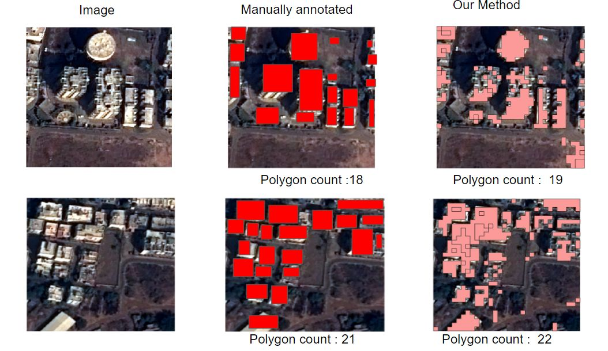

# Who am I ?

#### Dedicated and innovative Data Professional with a 3+ years of professional experience. 
#### Strong background in machine learning, deep learning, and computer vision, natural language processing, big data analytics, and cloud computing, enabling me to deliver scalable and efficient solutions that address the evolving needs of organizations.

 ### I put my code in outer space! [Learn More](https://tinyurl.com/2y66uber)
 

# What am I good at? 

# My Projects and Products

Below are some of my projects with descriptions and links to their repositories:

| Project | Description |
|---------|-------------|
|  | [Unsupervised Satellite Image Building Rooftop Detection](https://www.linkedin.com/posts/bastinjob_satelliteimaging-aiinnovation-unsupervisedlearning-activity-7094535204324671488-RhFm?utm_source=share&utm_medium=member_desktop) |
|  | Brief description of project 2. |
|  | Brief description of project 3. |
|  | Brief description of project 4. |
|  | Brief description of project 5. |
|  | Brief description of project 6. |
|  | Brief description of project 7. |
|  | Brief description of project 8. |

Here are some ideas to get you started:

- 🔭 I’m currently working on ...
- 🌱 I’m currently learning ...
- 👯 I’m looking to collaborate on ...
- 🤔 I’m looking for help with ...
- 💬 Ask me about ...
- 📫 How to reach me: ...
- 😄 Pronouns: ...
- ⚡ Fun fact: ...
-->
