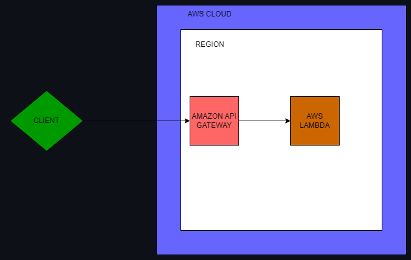
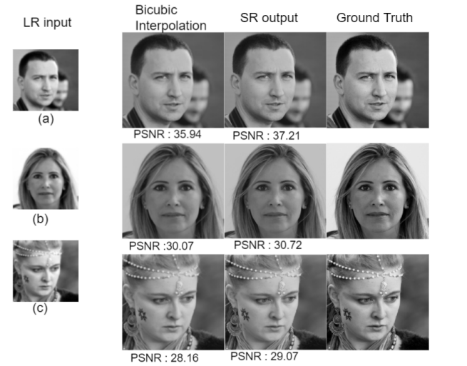
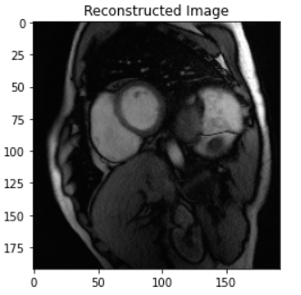

# Who am I ?

#### Full stack data science and machine learning practitioner with 3+ years of professional experience. 
#### Strong background in machine learning, deep learning, and computer vision, natural language processing, big data analytics, and cloud computing.

 ### I put my code in outer space! [Learn More](https://tinyurl.com/2y66uber)
 

# What am I good at? 

# My Projects and Products

Below are some of my projects with descriptions and links to their repositories:

| Project | Description |
|---------|-------------|
|  | [Exploring MLOPS: All methods of ML Model Deployment and Maintenance from Coantinerized to Serverless](https://github.com/bastinjob/Body-Mass-Index-Prediction) |
|  | [Blind Super Resolution with Contrastive Learning (GEN AI)](https://github.com/bastinjob/Blind-Super-Resolution-with-Contrastive-Learning) |
|  | [Unsupervised Satellite Image Building Rooftop Detection](https://www.linkedin.com/posts/bastinjob_satelliteimaging-aiinnovation-unsupervisedlearning-activity-7094535204324671488-RhFm?utm_source=share&utm_medium=member_desktop) |
|  | [Dining Hall Subshift Database Management System](https://github.com/bastinjob/Employee-Subshift-Database-System) |
|  | [Accelerated MRI Reconstruction Using Auto Encoders](https://github.com/bastinjob/Accelerated-MRI-Reconstruction-using-AutoEncoders) |

