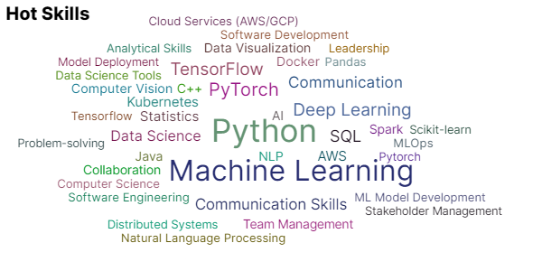

# I am Bastin 

#### I am a dedicated and innovative Data Scientist with a strong background in machine learning, deep learning, and computer vision. 
#### With extensive 3+ years of experience in both academic and industrial settings, I have consistently demonstrated my ability to leverage advanced analytical techniques to solve complex problems and drive impactful results. 
#### My expertise spans across various domains including natural language processing, big data analytics, and cloud computing, enabling me to deliver scalable and efficient solutions that address the evolving needs of organizations.

 ### I put my code in outer space! [Learn More](https://tinyurl.com/2y66uber)
 

Here are some ideas to get you started:

- 🔭 I’m currently working on ...
- 🌱 I’m currently learning ...
- 👯 I’m looking to collaborate on ...
- 🤔 I’m looking for help with ...
- 💬 Ask me about ...
- 📫 How to reach me: ...
- 😄 Pronouns: ...
- ⚡ Fun fact: ...
-->
